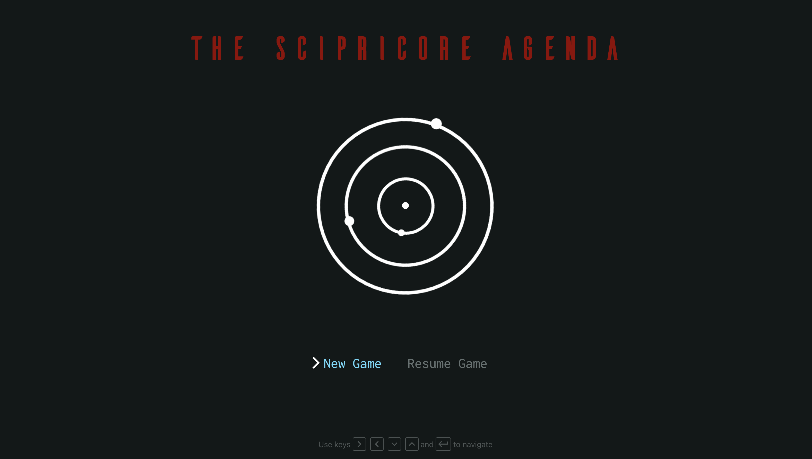

# [The Scipricore Agenda](https://trotr-client.herokuapp.com/)

[comment]: <> ( ![version]&#40;https://img.shields.io/badge/version-1.9.0-blue.svg&#41;  [![GitHub issues open]&#40;https://img.shields.io/github/issues/creativetimofficial/ct-material-kit-pro-react.svg?maxAge=2592000&#41;]&#40;https://github.com/creativetimofficial/ct-material-kit-pro-react/issues?q=is%3Aopen+is%3Aissue&#41; [![GitHub issues closed]&#40;https://img.shields.io/github/issues-closed-raw/creativetimofficial/ct-material-kit-pro-react.svg?maxAge=2592000&#41;]&#40;https://github.com/creativetimofficial/ct-material-kit-pro-react/issues?q=is%3Aissue+is%3Aclosed&#41; [![Join the chat at https://gitter.im/NIT-dgp/General]&#40;https://badges.gitter.im/NIT-dgp/General.svg&#41;]&#40;https://gitter.im/creative-tim-general/Lobby&#41; [![Chat]&#40;https://img.shields.io/badge/chat-on%20discord-7289da.svg&#41;]&#40;https://discord.gg/E4aHAQy&#41;)

**[The Scipricore Agenda](https://scipricore.herokuapp.com/)** is a text-based sci-fi adventure.

Its feature-set includes basic email/password authentication supported by Firebase then largely
revolves around heavily stylized effects that utilize a mix of React hooks and event listeners. 
Several game interface components expand on basic HTML page-building to support typewriter effects
and gameplay dialogue interactions. As gameplay is keyboard driven with no mouse / click listeners,
much of the component hierarchy depends on use of refs to focus on specific HTML elements.

## Table of Contents

* [Technologies](#technologies)
* [Quick Start](#quick-start)
* [Browser Support](#browser-support)
* [Licensing](#licensing)

## Technologies

- [CSS](https://developer.mozilla.org/en-US/docs/Web/CSS)
- [HTML]()
- [React](https://demos.creative-tim.com/material-kit-pro-react/#/components#buttons)
- [Node](https://demos.creative-tim.com/material-kit-pro-react/#/components#navigation)
- [Express](https://demos.creative-tim.com/material-kit-pro-react/#/components#notifications)
- [MongoDB](https://demos.creative-tim.com/material-kit-pro-react/#/profile-page)
- [Mongoose](https://demos.creative-tim.com/material-kit-pro-react/#/landing-page)
- [React-Sound](https://www.npmjs.com/package/react-sound)
- [Use Sound](https://www.npmjs.com/package/use-sound)
- [Heroku](https://heroku.com)

## Quick start

- Visit the [Scipricore Agenda](https://trotr-client.herokuapp.com/) website, create an account and a new character, and jump into the game!

## Browser Support

Recommended browsers for using this app:

 

## Licensing

- Copyright 2021 Cubby Alexander